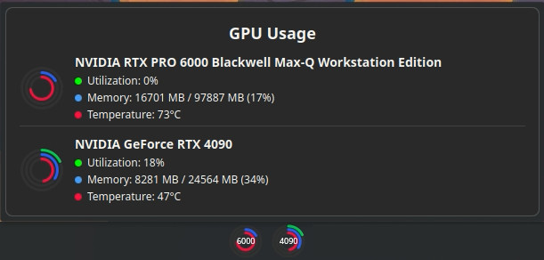

# gpuusage_kde

## (gpuusage_kde)

* Description: KDE Widget that monitors NVIDIA GPU usage
* Copyright: AXISFX LTD
* Author: Ewan Davidson
* Email: ewan@axisfx.design
* Release Date: 27.10.2025
* Current Version: 1.0

## Features

* Utilization shown in red
* VRAM Usage shown in blue
* Temperature shown in red
* Supports multiple GPUs

## Negative Features

* Coded with AI (I'm not learning qml or javascript)
* Tested only on KDE version 5.24.7

## Dependencies

* nvidia-smi
* KDE version 5.24.7

## Changes

### 1.0  |  27.10.2025

* Initial release